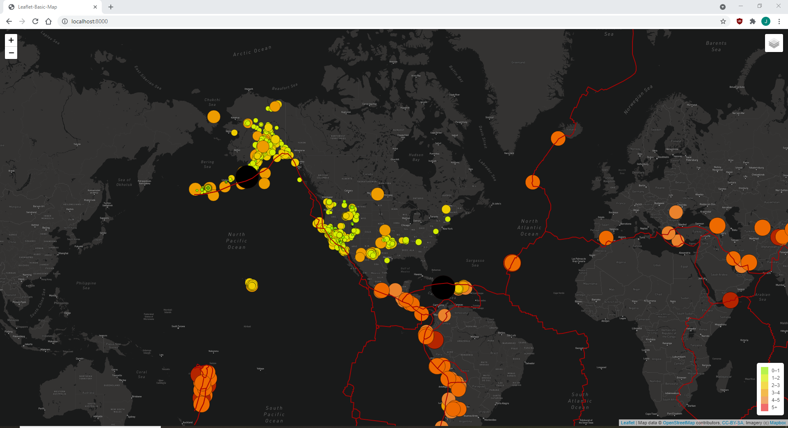

# Mapping Earthquakes
## Purpose
The following project is made with the aim of providing an interactive map that takes in real-time data of recent earthquakes and visualizes it on the web page.

## How to open the visualization tool
After you download and unpack the repository, navigate through your command like to the ```Earthquake_Challenge``` folder. Once you are in the folder, type in the command line:

```python -m http.server```

To start the local server. Using your web browser, navigate to the local server address. You will be presented with the deafult image.


